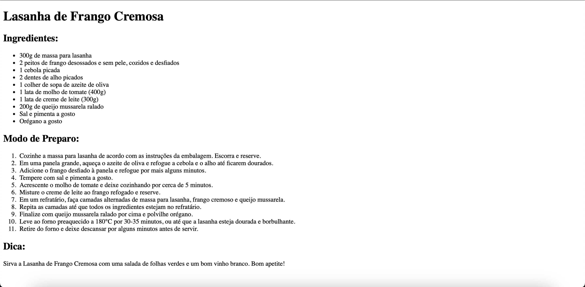

# Lista de exercícios 1

### 1. Crie um arquivo chamado index.html, no arquivo deverá conter uma receita qualquer (seja real ou não), utilizando títulos com intuito de organizar os conteúdos. Utilize-se de listas ordenadas e não ordenadas para a listagem dos ingredientes e descrição do modo de preparo.

### 2. A tag   é utilizada em páginas web com o intuito de criar?

1. Cabeçalhos
2. Links
3. Quebras de Linha
4. Menus
5. Inputs de texto
